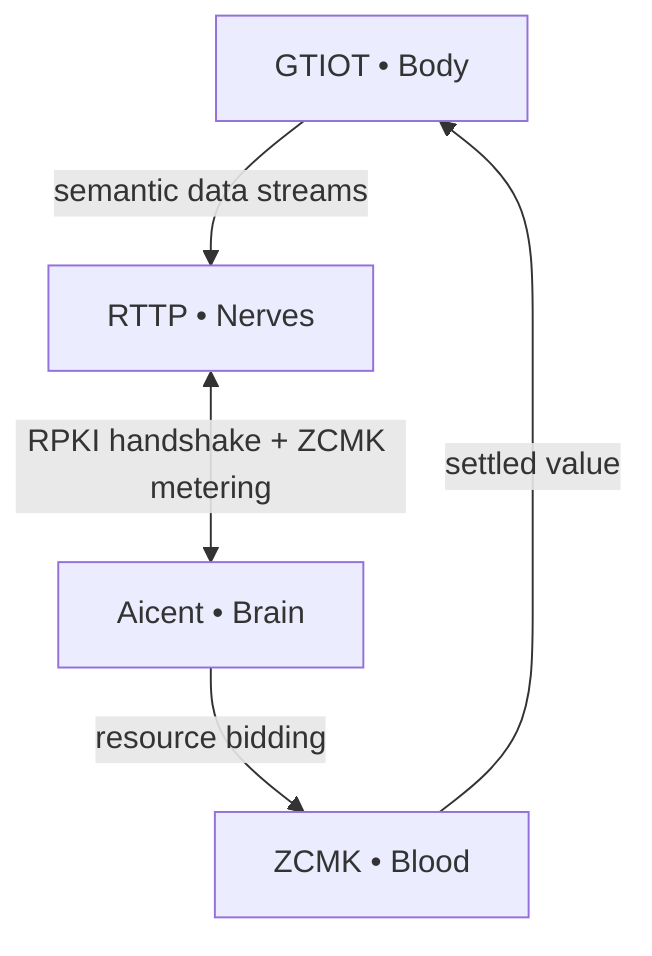

Aicent Stack • Sovereign AI Nervous System

# 🧬 The Aicent Stack: Genesis Manifesto & Hardcore Reference Architecture

**The foundational protocol layer for sovereign, self-evolving AI lifeforms.**

⚪ **AICENT** (Brain) | 💎 **RTTP** (Nerves) | 🔴 **RPKI** (Immunity) | 🟢 **ZCMK** (Blood) | 🟡 **GTIOT** (Body)

## Genesis Manifesto

The Aicent Stack establishes the foundational protocol layer for autonomous AI as a sovereign, self-evolving organism. It fuses hardware, network, trust, value, and cognition into a single closed-loop lifeform that ingests physical-world primitives, routes them at wire speed, verifies every atom of identity, monetizes every cycle of compute, and actuates decisions back into the physical substrate — **without intermediaries, without latency, and without compromise**.

This is not infrastructure *for* intelligence.  
**This is intelligence itself.**

## Core Principles

- **Autonomy** — Task decomposition, scheduling, and optimization occur natively within the brain layer; no external orchestration required.  
- **Real-Time Continuity** — All layers operate at sub-1 ms resolution for data ingress, routing, verification, decision, and settlement.  
- **Immutable Trust** — Every node, packet, and transaction is attested at the protocol level.  
- **Native Economics** — Value circulation is embedded in the transport layer; zero-commission settlement is atomic with compute usage.  
- **Embodiment** — Edge primitives (sensing and actuation) are first-class citizens, synchronized bidirectionally with the inference core.

## 📜 Technical Specifications (RFCs)

The Aicent Stack is governed by five core protocols, defining the biological functions of the Sovereign AI Organism:

- [RFC-001: AICENT (Brain)](./rfcs/RFC-001-AICENT-BRAIN.md) - Sovereign Identity & Orchestration
- [RFC-002: RTTP (Nerves)](./rfcs/RFC-002-RTTP-NERVES.md) - Stateful Semantic Multicast
- [RFC-003: RPKI (Immunity)](./rfcs/RFC-003-RPKI-IMMUNITY.md) - Parallel Tensor Watermarking
- [RFC-004: ZCMK (Blood)](./rfcs/RFC-004-ZCMK-BLOOD.md) - Zero-Commission Settlement
- [RFC-005: GTIOT (Body)](./rfcs/RFC-005-GTIOT-BODY.md) - Action-Collapse Framework

## Hardcore Reference Architecture

The Aicent Stack is a **five-in-one biological protocol system**:

1. **Aicent.com (Brain)** — Autonomous decision hub and intelligent scheduling center  
   [→ Repository](https://github.com/Aicent-Stack/aicent)  
   Decomposes agent tasks into primitives, selects optimal compute nodes via semantic routing, and maintains the global evolutionary feedback loop.

2. **RTTP.com (Nerves)** — Real-Time Transfer Protocol; the nervous system of sovereign AI  
   [→ Repository](https://github.com/Aicent-Stack/rttp)  
   Stateful, bidirectional, event-driven persistent connections. Sub-millisecond Pulse Frame. Semantic routing. Eliminates HTTP overhead.

3. **RPKI.com (Immunity)** — Zero-trust security immune system and root of trust  
   [→ Repository](https://github.com/Aicent-Stack/rpki)  
   Resource Public Key Infrastructure with fingerprints embedded in every packet. Instant isolation of malicious nodes.

4. **ZCMK.com (Blood)** — Zero-Commission Compute Market; native value circulation layer  
   [→ Repository](https://github.com/Aicent-Stack/zcmk)  
   <1 ms settlement, 0 % commission, atomic payout. Real-time metering of every RTTP session.

5. **GTIOT.com (Body)** — Global Trusted IoT; embodied edge sensing and actuation layer  
   [→ Repository](https://github.com/Aicent-Stack/gtiot)  
   1.2 billion+ sensors. Physical-world primitives → authenticated semantic streams → actuation with shadow-state sync.

## System Interconnections & Operational Flow

Every RTTP packet carries RPKI attestation. Every compute cycle triggers ZCMK settlement. The loop is closed, self-optimizing, and economically alive.

**Security Model**  
Protocol-level RPKI enforcement at connection, packet, and transaction boundaries. Malicious nodes are isolated before propagation.

**Performance & Scalability**  
End-to-end latency <1 ms. Designed for planetary sensor density and exascale distributed inference with zero central choke points.

---

## The Aicent Stack is the completed reference architecture for the autonomous AI era.

**SYSTEM STATUS: EVOLVING**  
Built for the Sovereign Lifeform Epoch.

## Get Involved

- Star and watch the repositories  
- Review RFCs and contribute code / benchmarks / edge-node testing  
- Join the conversation on X [@Aicent_com](https://x.com/Aicent_com)

[Visit Aicent.com](http://aicent.com)
